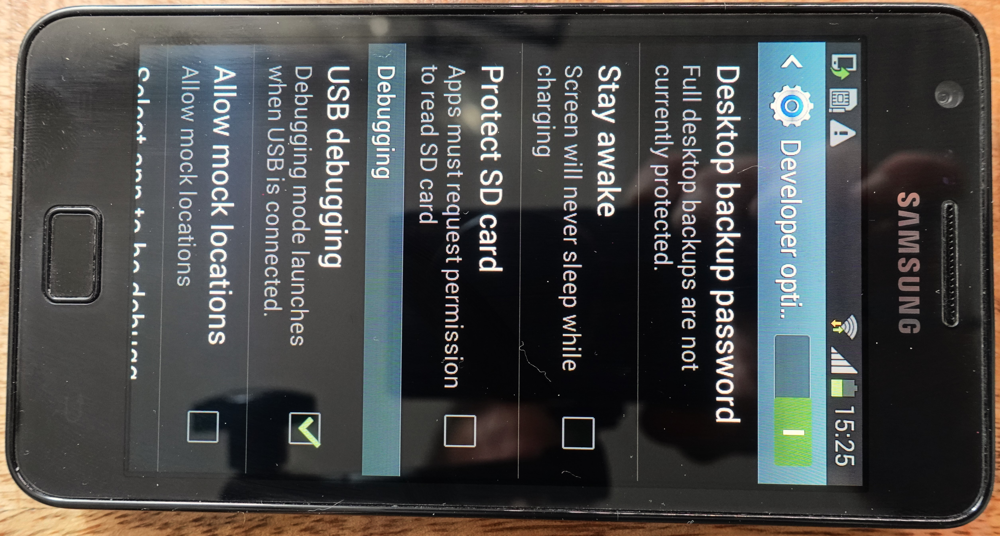

# Reuse Used Smartphones and Tablets in Electronics Projects
With a USB on-the-go (OTG) adapter, an Android device can control a FT232 USB to serial converter. This example app can read or write its Rx and Tx pins, as well as the six modem control signals RTS, CTS, DTR, DSR, DCD and RI. This gives us a total of eight GPIOs.

With the app we can switch the LEDs on and off using the four buttons. We can make them flash using the checkboxes to the right of them. The remaining four control signals are configured as inputs. Their levels are displayed by the radio buttons in the bottom row.

Whether a pin is an input or an output is determined by its wiring. A resistor to Vcc makes it an open-collector output. A 47k resistor to ground makes it an input.

Alternatively, an LED can be connected directly between the pin and Vcc. The pin limits the current to 15mA, thus no resistor is needed.

## Description of The Android-App
Apps for the Android operating system are written in Java or Kotlin. The programming environment is Android Studio, which can be downloaded free of charge from Google's Android developer pages. 
The sample app consists of three Java source files:

### MainActivity.java
The interaction with the user of the app is defined in the “MainActivity” (user interface). 

### UsbIOService.java
The user interface does not have direct access to the smartphone's USB interface. This is done in a background service. 
The service reads the digital inputs of the FT232 cyclically at the highest possible speed. If these change between two runs, the MainActivity is notified so that it can display this accordingly using its UI elements. Of course, the UsbIOService also sets the digital outputs on request.

### Sketch.java
This is where we find the actual application logic. If you already have experience in creating Arduino sketches, you will quickly find your way around: The setup() function is called once by the UsbIOService when the app is started. The pinMode() function is used to configure the four output ports. (By default, the ports are inputs; this does not need to be configured). 
The UsbIOService calls the loop() function cyclically. The classic commands from the Arduino framework make the LEDs flash here.

 

## Software Architecture
The figure illustrates the interaction of the three components. The virtual pins are used to exchange data between the UI and the Arduino sketch. There are 24 of them in total. Both the UI and the sketch have access to the eight physical ports of the FTDI. The USB IO service is a single Java source code file that is located in the app's source directory. 

## Power Supply
The FT232 board and electronics connected to it are powered by the Android device through its USB port. The downside is that this uses up the battery life. This is a significant drawback for any application that needs to run for a longer time. So we need to find a way to power the phone or tablet itself. The first thing that comes to mind is the USB port. 
However, a USB port in OTG mode is a power source for the connected device, so it can't be used for simultaneous charging. Some people have managed to do this by rooting the phone and hacking the firmware, but it's a lot of work, so we're not going to go into it here.
If your mobile device has an external charging port or the option of contactless charging, you're in luck. However, this is only the case for a few models. 
In most cases, we have to expose the power connectors from the battery ourselves. This is still pretty easy to do on older devices because the batteries are often replaceable. The picture shows a Samsung Galaxy S2. I replaced the battery with a stripe board, which I cut to size to fit exactly into the recess of the battery. I used solder to make good contact where the spring contacts are. The pins for the battery voltage and polarity are printed on the battery, and they are easy to identify. 

This allows the smartphone to run on an external power supply between 3 and 4.2 volts, which is the voltage range of a lithium-ion battery. It's conceivable that the device can also tolerate 5 volts at the battery terminals, but I didn't want to take the risk of blowing it up... A buck converter module like the HW-411 shown in the picture does limit the maximum voltage to 4 volts and also allows for a current of at least one Amp. 

>Security Advise: Permanently installed batteries must be disconnected from the external supply voltage to prevent destruction (and fires in the worst case) due to overcharging.

## First Steps in Android Studio
Download Android Studio from https://developer.android.com/studio. The following steps refer to version 2024.1.1 (Koala). When you start the program for the first time, the Android Studio Setup Wizard starts.  

After you have installed Android Studio and the Android SDK, you will see the following dialog box when you launch it for the first time:

There you click on "Get from VCS" and enter the following URL: https://github.com/michalin/Android_UsbIO (This repository)

> “Git” must be installed in order to carry out this step. If you see the message “Git is not installed”, use the “Download and Install” link to install it. 

The source files for the sample app are now downloaded. 
It takes a few minutes for the “Gradle” build system to generate the project, but if everything was successful, we can already take a quick look at the project.

### Download the app to the Android device
In order for the app to be loaded onto the smartphone or tablet, USB debugging must first be activated on the Android device. To do this, open the settings and scroll all the way down. There, open the “Developer options”, switch them on and activate “USB debugging”.

>Note: From Android version 4.2, the developer options are hidden and must be activated beforehand. To do this, tap on “Phone info”, then on “Software information” and tap the build number seven times. A different procedure may be required for individual manufacturers. Your trusted search engine or AI will be happy to help.

Then connect the device to your computer via USB. A dialog will appear asking if you want to allow the computer to debug the mobile device. After confirming, the name of the device will appear at the top of Android Studio. Click on the green triangle to load and run the app on the target device.

   

### Download the app to the Target Device over WLAN
Constantly plugging and unplugging the computer and FTDI module is quite impractical when programming the app. Fortunately, however, there is the option of loading apps via WLAN. This means that the USB interface can remain connected to the FTDI module while you can conveniently load and debug your app on the device via Android Studio. To set it up, first
add the Android Debug Bridge (ADB) directory to the path variable. 
The Android Debug Bridge (ADB) command line tool is part of the Android SDK that allows developers to install apps, debug, transfer files and comprehensively manage Android devices. It is located under `C:\Users\{username}\AppData\Local\Android\Sdk\platform-tools\adb.exe`

Adding ADB to the Path variable can either be done in the control panel or in the terminal window of Android Studio. Enter the following there: 
`[Environment]::SetEnvironmentVariable("PATH",$Env:PATH+";$Env:LOCALAPPDATA\Android\Sdk\platform-tools",[EnvironmentVariableTarget]::"User")`

Now connect your mobile device to the computer via USB and enter `adb tcpip 5555`. Make sure that your computer and the device are in the same WLAN network and enter `adb connect <IP address>`. The adb is now connected via WLAN.
This is particularly convenient with the integrated terminal of Android Studio.

----
>Notes: 
>- You can find the IP address either in the WLAN settings of your mobile device or the configuration of your WLAN router.
>- Before a new debug session, you only need to call `adb connect <IP address>`. This also works via WLAN, the device does not need a USB connection.
>- `adb tcpip 5555` activates WLAN debugging. This remains active until USB debugging is deactivated or Android is restarted. For security reasons, USB debugging should always be switched off if it is not required.

## Youtube Video

